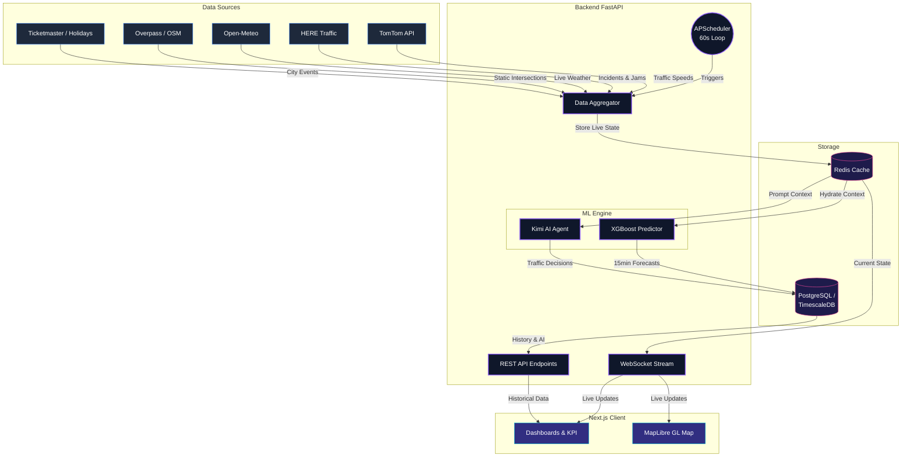

# Urban Traffic Brain — Base Version

AI-powered city-wide traffic management system using freely available internet data sources.
No physical cameras or hardware required. Fully functional demo-ready system.

## Quick Start

```bash
# 1. Clone and configure
cp .env.example .env
# Edit .env with your API keys (or leave defaults for simulation mode)

# 2. Start everything
docker compose up -d

# 3. Open dashboard
# → http://localhost:3000 (Next.js dashboard)
# → http://localhost:8000/health (Backend health check)
# → http://localhost:8000/docs (FastAPI Swagger UI)
```

## Architecture

| Service | Port | Tech |
|---------|------|------|
| Backend | 8000 | FastAPI + Python 3.11 |
| Frontend | 3000 | Next.js 14 + TailwindCSS |
| Database | 5432 | TimescaleDB (PostgreSQL 15) |
| Cache | 6379 | Redis 7 |
| Proxy | 80 | Nginx |

## Data Sources

| Source | Type | Key Required? |
|--------|------|--------------|
| TomTom Traffic API | Live speed/congestion | Yes (free tier: 2500/day) |
| HERE Maps Traffic | Incidents + jam factor | Yes (free tier: 250k/month) |
| Open-Meteo Weather | Forecast + precipitation | **No** (completely free) |
| OpenWeatherMap | Weather fallback | Yes (free tier: 60/min) |
| Overpass API (OSM) | Road network / intersections | **No** (completely free) |
| Ticketmaster | City events | Yes (free tier) |
| Public Holiday API | Holiday detection | **No** (completely free) |

## Simulation Mode

Set `SIMULATION_MODE=true` (default) to run without real API keys.
All fetchers generate realistic fake data so the full pipeline is always demo-able.

## Data Flow Architecture

The Urban Traffic Brain relies on a synchronous ETL pipeline that fetches live data, processes it via ML models, stores it, and streams the unified state to the frontend.



## Folder Structure

The repository is logically separated into the `frontend/` (Next.js React app) and `backend/` (FastAPI Python server) directories.

```text
urban-traffic-brain/
├── docker-compose.yml       # Orchestrates app, postgres, redis, nginx
├── nginx.conf               # Reverse proxy routing (port 80 -> 3000/8000)
├── .env                     # Shared environment variables
│
├── frontend/                # Next.js 14 Web Application
│   ├── app/                 # App router pages (/, /map, /events, etc.)
│   ├── components/          # Reusable React UI components (CityMap, Alerts)
│   ├── hooks/               # Custom React hooks (useTrafficSocket)
│   ├── lib/                 # Utilities (api client, map config, styles)
│   └── public/              # Static assets
│
└── backend/                 # FastAPI Python Server
    ├── api/
    │   ├── routes/          # REST endpoints (traffic, events, decisions)
    │   └── websocket.py     # Live data socket streaming
    ├── data_fetchers/       # Scripts to call external APIs (TomTom, HERE)
    ├── db/                  # SQLAlchemy models and Redis state manager
    ├── models/              # Pydantic schema schemas
    ├── scheduler/           # APScheduler configuration and data jobs
    ├── main.py              # FastAPI application entry point
    └── config.py            # Global settings loader
```

## Frontend Pages

- **Dashboard** (`/`) — KPIs, charts, top hotspots, weather, emissions, AI decisions
- **Live Map** (`/map`) — MapLibre GL heatmap with intersection details
- **AI Decisions** (`/decisions`) — Live decisions + paginated history
- **Emissions** (`/emissions`) — CO₂ tracking and recommendations  
- **Events** (`/events`) — City events and weather impact

## API Endpoints

```
GET  /api/traffic/city-state
GET  /api/traffic/intersection/{id}
GET  /api/traffic/heatmap
GET  /api/predictions/{intersection_id}
GET  /api/decisions/live
GET  /api/decisions/history?page=1
POST /api/decisions/{id}/approve
POST /api/decisions/{id}/reject
GET  /api/incidents/active
GET  /api/events/active
POST /api/events/
GET  /api/weather/current
GET  /api/emissions/live
GET  /api/emissions/report
GET  /api/alerts/active
POST /api/alerts/{id}/acknowledge
GET  /api/datasources/status
WS   /ws/traffic
```

## Switching Cities

Change the target city by updating `.env`:
```
CITY_NAME=London
CITY_BBOX=51.28,-0.51,51.69,0.33
```
Restart the system. The OSM loader will automatically fetch intersections for the new city.

## Tech Stack

**Backend:** Python 3.11, FastAPI, APScheduler, Redis, PostgreSQL + TimescaleDB, SQLAlchemy, httpx  
**AI:** Kimi API (moonshot-v1-128k), XGBoost, Scikit-learn  
**Frontend:** Next.js 14, TailwindCSS, MapLibre GL JS, Recharts, Socket.IO  
**Infra:** Docker Compose, Nginx
